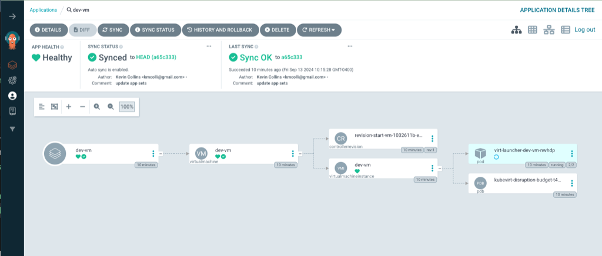
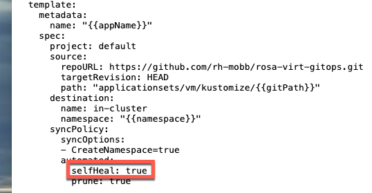
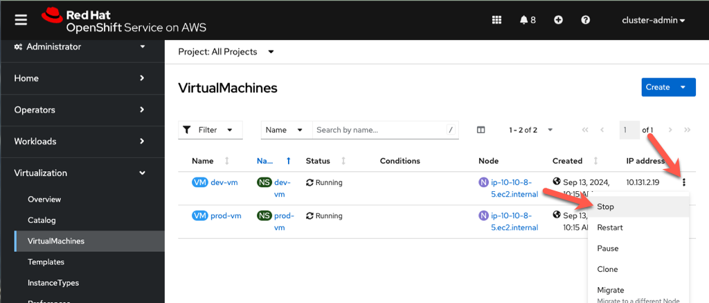
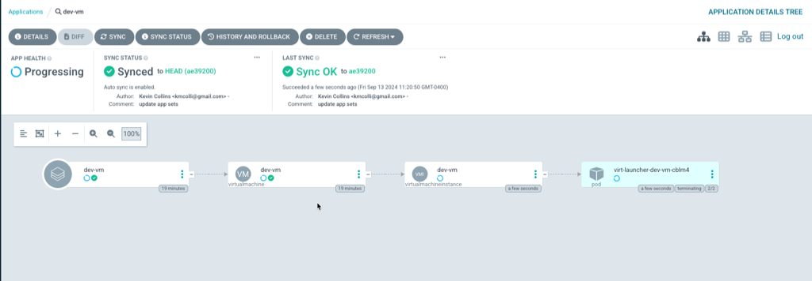

One of the great things about OpenShift Virtualization is that it brings new capabilies to run virtual machines alongside your containers AND using DevOps processes to manage them.

This tutorial will show how to configure OpenShift GitOps ( based on ArgoCD ) to deploy and managed virtual machines.

## Pre-requisites

* A ROSA Cluster with OpenShift Virtualization (see [Deploying OpenShift Virtualization on ROSA](/experts/rosa/ocp-virt/basic/))
If you follow the guide above, you can skip the *Create a Virtual Machine* section as we will be using OpenShift GitOps to deploy the cluster.
* The `git` binary installed on your machine.  You can download it from the [git website](https://git-scm.com/downloads).


## Prepare the Environment

1. Retrieve the source code to deploy VMs with OpenShift GitOps

    ```bash
        git clone https://github.com/rh-mobb/rosa-virt-gitops

        cd rosa-virt-gitops
    ```


## Install the OpenShift GitOps Operator

    ```bash
    cat << EOF | oc apply -f -
    apiVersion: v1
    kind: Namespace
    metadata:
      name: openshift-gitops-operator
    ---
    apiVersion: operators.coreos.com/v1
    kind: OperatorGroup
    metadata:
      name: kubevirt-hyperconverged-group
      namespace: openshift-gitops-operator
    spec:
      targetNamespaces:
        - openshift-gitops-operator
    ---
    apiVersion: operators.coreos.com/v1alpha1
    kind: Subscription
    metadata:
      name: openshift-gitops-operator
      namespace: openshift-gitops-operator
    spec:
      source: redhat-operators
      installPlanApproval: Automatic
      sourceNamespace: openshift-marketplace
      name: openshift-gitops-operator
      channel: "stable"
    ---
    apiVersion: user.openshift.io/v1
    kind: Group
    metadata:
        name: cluster-admins
    users:
        - admin
    EOF
    ```

## Configure OpenShift GitOps

1. Create an OpenShift GitOps Application Set

    For demonstrations purposes, we will deploy two VMs, one for Dev and one for Production.  Usually, these VMs would be deployed to different clusters but the sake a simplicity, we will deploy these VMs to different namespaces.

    ```bash
        oc apply -n openshift-gitops -f applicationsets/vm/applicationset-vm.yaml
    ```

2. Verify the applications ( VMs ) were created in OpenShift GitOps.

    Retrieve and open the OpenShift GitOps URL.
    ```bash
        oc get route openshift-gitops-server -n openshift-gitops -o jsonpath='{.spec.host}{"\n"}'
    ```

    expected output
    ```text
        openshift-gitops-server-openshift-gitops.apps.rosa.kevcolli-hcp1.dp4i.p3.openshiftapps.com
    ```

    Open the url in a browser and notice there are two ArgoCD applications that were created.
    

    Notice there is one application for dev and one for prod.

    Click into one of the applications, and see that everything is synced and all the resources that were created.
    

    Next, let's view the virtual machines that were created.

    In the OpenShift console, from the menu click on Virtualization and the Virtual Machines.   Make sure All Projects is selected.

    

    Notice that there is a dev-vm which is in the dev-vm namespace and a prod-vm in the prod-vm namespace.

3. Manually change a VM

    One of the great benefits of OpenShift GitOps is that it will keep the state of the resources that you specified.  

    If you look at the VirtualMachine definition at 
    [VirtualMachine](https://raw.githubusercontent.com/rh-mobb/rosa-virt-gitops/main/applicationsets/vm/kustomize/base/virtualmachine.yaml) 
    
    notice that the Virtual Machine is specified as it should be running.
    

    When the ArogCD ApplicationSet was applied, self healing was set to true.

    [ApplicationSet](https://raw.githubusercontent.com/rh-mobb/rosa-virt-gitops/main/applicationsets/vm/applicationset-vm.yaml)
    

    What this means is if we do something like stop the VM, Argo will restart it automatically.  Let's test it out.

    > Make sure to have the ArgoCD UI up and ready in a new tab, the change happens very fast.  

    From the list of VMs, click on Stop next to the Dev VM.  Once you click stop, switch over to the ArgoCD tab.
    

    Switching over the ArgoCD UI, noticed the App Healh shows "Progressing" and the dev-vm is being started.
    

    After a few seconds, the Application shows health again and the vm is running.
    

    Navigating back to the list of VMs in OpenShift, both VMs are running.
    

4. Make changes to the virtual machines through git.


